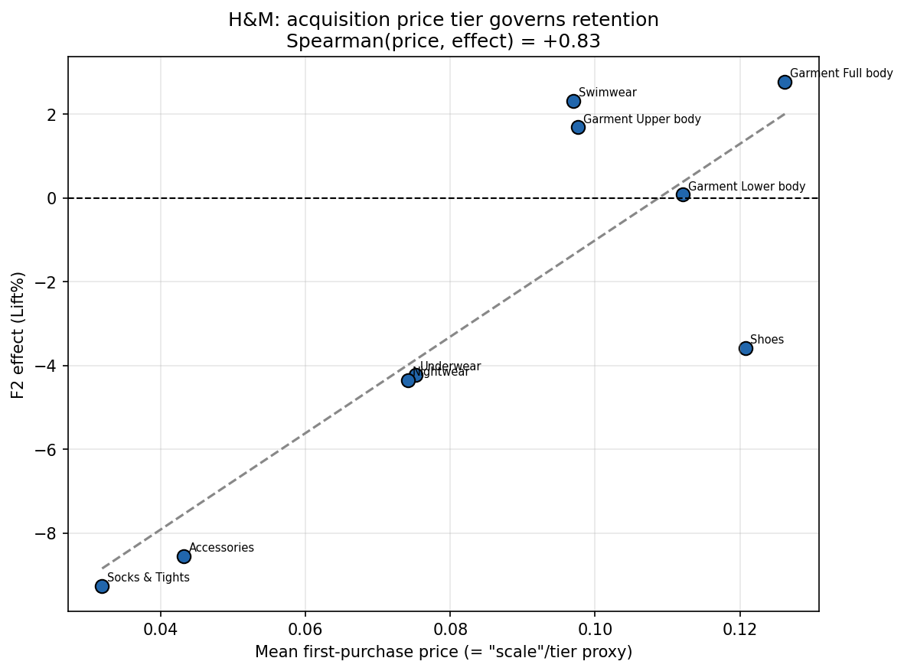
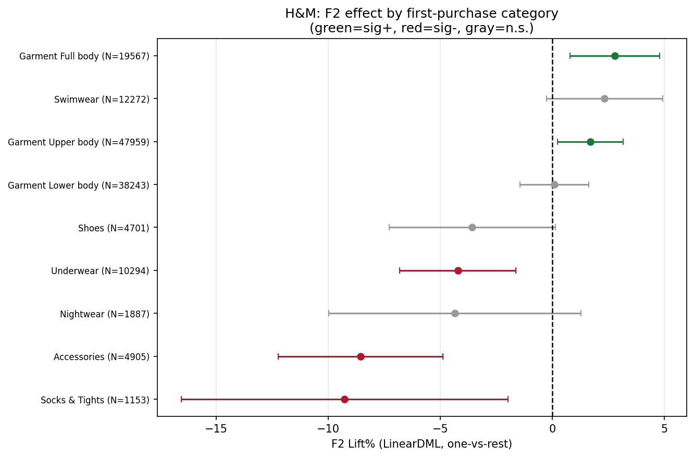
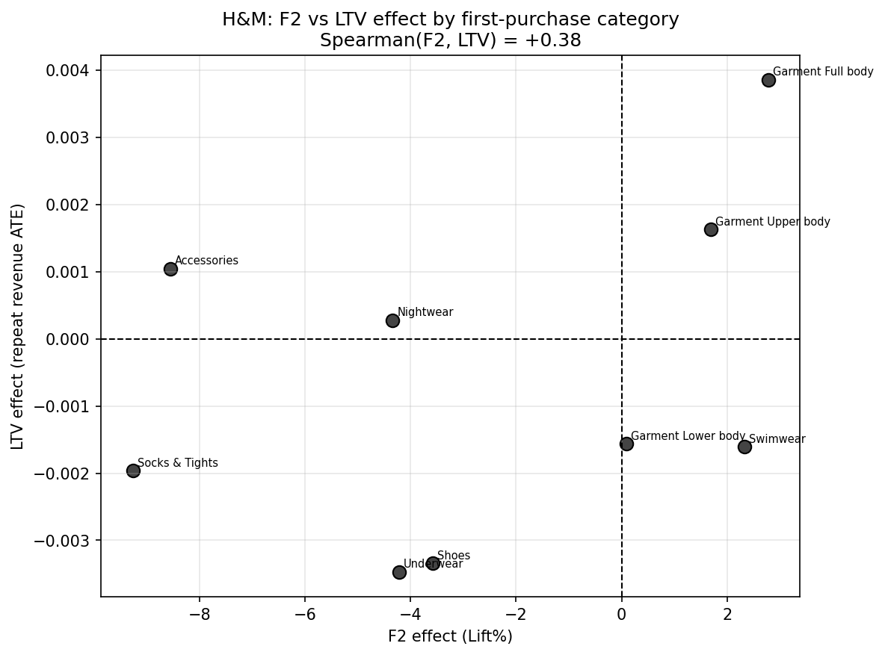

[README.md](https://github.com/user-attachments/files/28543796/README.md)
# Acquisition-Category → Retention/LTV: Heterogeneous Causal Effects (H&M public replication)

Public, reproducible replication of an apparel e-commerce finding:
**the product category through which a customer is acquired causally affects their later retention (F2) and LTV — and this heterogeneity is largely governed by a single product characteristic (price tier).**

This repo reproduces the result on the public **H&M Personalized Fashion Recommendations** dataset (Kaggle), so anyone can verify the method on open data.

---

## What it does

- **Treatment** `T(g)`: a customer's **first purchase category** (`product_group_name`) equals `g` — estimated one-vs-rest.
- **Outcomes**: `F2` = a repeat purchase within *N* days of the first purchase (binary); `LTV` = repeat revenue within the window (continuous, winsorized at the 99th pct).
- **Estimator**: **LinearDML** (double machine learning, `econml`) with `X=None` and `W` = customer covariates (age, club status, news-frequency, first-basket amount/size, channel, month).
- **Heterogeneity**: per-category ATE, then `Spearman(mean first-purchase price, ATE)` — does a single characteristic (price tier) explain which acquisition categories retain better?

### Headline result on H&M (`--sample-frac 0.2`, N≈141k first-time buyers)
- Significant heterogeneity across categories: **5 of 9 categories significant for F2, 4 of 9 for LTV**.
- **Spearman(price tier, F2 effect) = +0.83**: customers acquired via higher-price garments retain better; low-price commodities (socks, accessories, underwear) retain worst.
- F2 and LTV effects are positively correlated (**Spearman = +0.38**) — the structure holds on the monetary outcome too.

> Numbers vary slightly with `--sample-frac`/seed but the qualitative pattern is stable.

#### Example figures (produced by this script)

**Acquisition price tier governs retention (F2):**



**Per-category F2 effect (95% CI):**



**F2 vs LTV effect by category:**



---

## A methodological note (why `W` excludes item attributes)

Estimating "acquisition category → retention" has a common **pitfall**: if you put the *item attributes that define the treatment* (category, keyword) into the propensity/covariate set, the treatment becomes perfectly predictable (propensity AUC → 1.0), violating positivity/overlap and invalidating the causal comparison. We avoid this by defining the treatment at the **customer level** and using **only customer/context covariates** in `W`. (On two other public datasets, the same fix restores overlap; H&M is the powered, clean replication.)

---

## Setup

```bash
pip install -r requirements.txt
```

### Get the data (not redistributed here)
Download from Kaggle (account + acceptance of competition rules required):
<https://www.kaggle.com/competitions/h-and-m-personalized-fashion-recommendations/data>

Place these three files in `./data/`:
- `transactions_train.csv`
- `customers.csv`
- `articles.csv`

---

## Run

```bash
python run_hm_replication.py --data-dir ./data --out-dir ./output
```

Useful flags: `--sample-frac 0.2` (customer sampling), `--f2-window 90`, `--min-group-n 1000`,
`--cohort-start 2019-01-01 --cohort-end 2020-06-22`, `--seed 42`.

### Outputs (`./output/`)
- `hm_f2_by_category.csv`, `hm_ltv_by_category.csv` — per-category ATE, CI, lift%, mean price.
- `hm_price_vs_f2.png` — F2 effect vs price tier (the key heterogeneity figure).
- `hm_f2_forest.png` — per-category F2 effect with 95% CIs.
- Console summary incl. `Spearman(price, F2 effect)` and `Spearman(F2, LTV)`.

Runtime: a few–~15 min depending on `--sample-frac` and machine (transactions are large).

---

## Caveats
- **Observational** study: effects are adjusted for measured `W` but not randomized; treat as suggestive causal evidence.
- **One-vs-rest** treatment: each category vs. the mix of all others (control is heterogeneous).
- "First purchase" is approximated by the earliest transaction in the dataset window.
- This is a *method replication*; the moderating characteristic (price tier here) is dataset-specific.

## License
Code: MIT (see `LICENSE`). Data: belongs to H&M / Kaggle under their terms — **not** included or redistributed in this repository.
